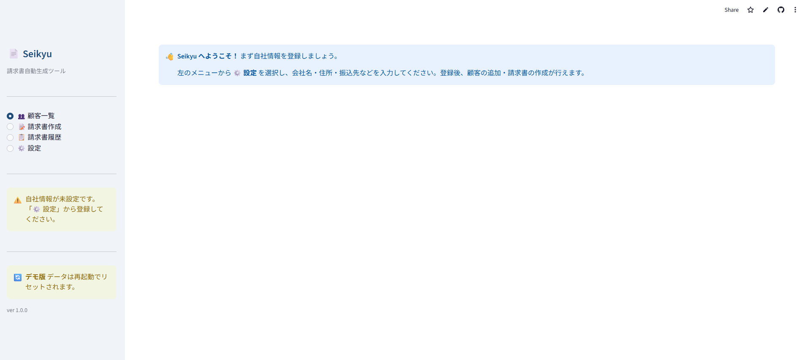
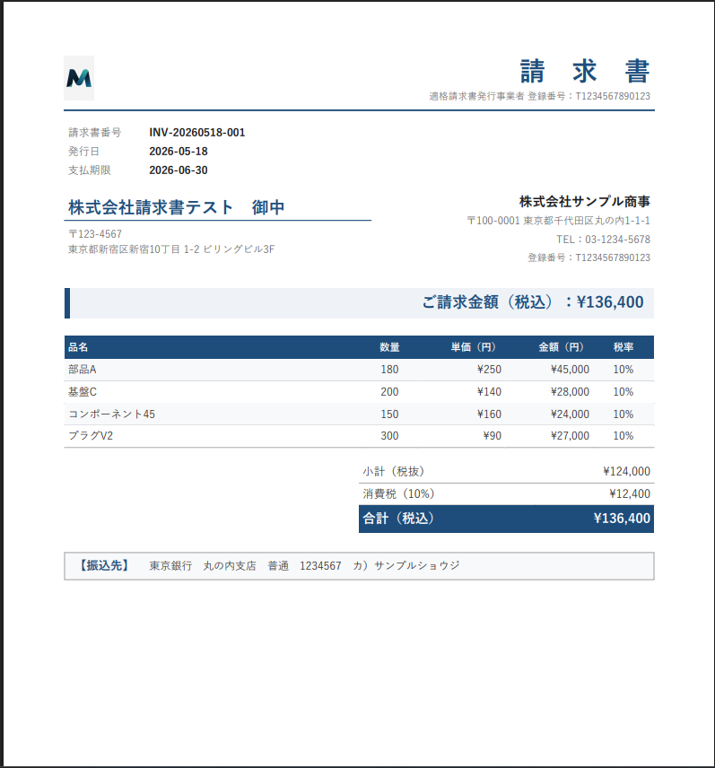
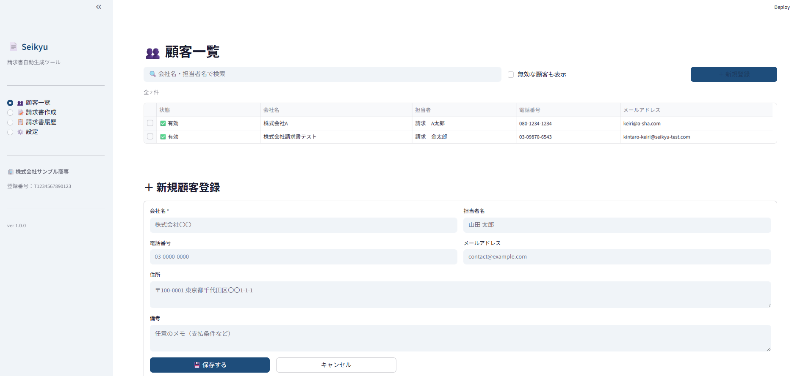

# 📄 Seikyu — 請求書自動生成ツール

<p align="center">
  
  
  
  
  
</p>

<p align="center">
  個人事業主・中小企業向けの日本語請求書作成・管理ツールです。<br>
  顧客管理から請求書の作成・PDF/Word 出力・履歴管理まで、ブラウザ上でシンプルに操作できます。<br>
  <strong>適格請求書（インボイス）</strong> にも対応しています。
</p>

<p align="center">
  <a href="https://seikyu-nryd4daxgvv6rejhwn3ao4.streamlit.app/"><strong>▶ Live Demo</strong></a>
  &nbsp;·&nbsp;
  <a href="#ローカル環境での起動">ローカル起動</a>
  &nbsp;·&nbsp;
  <a href="#デプロイ">デプロイ</a>
</p>

> **デモ版について**：デモ環境のデータはアプリ再起動時にリセットされます。実際の業務データは保存されません。

---

## スクリーンショット

| ホーム（顧客一覧） | 請求書 PDF プレビュー | 自社情報設定 |
|:-:|:-:|:-:|
|  |  |  |

---

## 主な機能

| 機能 | 説明 |
|------|------|
| 👥 **顧客管理** | 顧客の登録・編集・無効化・削除。無効化で請求書履歴を保持したまま非表示化 |
| 📝 **請求書作成** | 明細入力・自動採番（`INV-YYYYMMDD-XXX`）・消費税（10% / 8% 軽減税率）の自動計算 |
| 📄 **PDF 出力** | A4 サイズの日本語 PDF を即時生成（fpdf2 使用・Windows/Linux/macOS 対応） |
| 📘 **Word 出力** | `.docx` 形式で生成（python-docx 使用） |
| 📋 **請求書履歴** | 検索・絞込・再ダウンロード対応 |
| ⚙️ **設定** | 自社情報・振込先・ロゴ画像（PNG/JPG）の管理 |
| 🧾 **インボイス対応** | 適格請求書発行事業者登録番号の表示・印字 |

---

## 技術スタック

| カテゴリ | 技術 |
|----------|------|
| フロントエンド / フレームワーク | [Streamlit](https://streamlit.io/) 1.32+ |
| データベース | SQLite（通常: ファイル永続化 / デモ: インメモリ） |
| PDF 生成 | [fpdf2](https://py-pdf.github.io/fpdf2/)（純 Python・GTK 不要） |
| Word 生成 | [python-docx](https://python-docx.readthedocs.io/) |
| データ処理 | [pandas](https://pandas.pydata.org/) |
| 画像処理 | [Pillow](https://python-pillow.org/)（ロゴ埋め込み） |
| 環境変数 | [python-dotenv](https://github.com/theskumar/python-dotenv) |
| 言語 | Python 3.10+ |

---

## ファイル構成

```
Seikyu/
├── app.py                  # メインアプリ（ルーティング・サイドバー）
├── database.py             # SQLite データベース層（CRUD・デモモード対応）
├── models.py               # データクラス定義（CompanyInfo, Customer, Invoice）
├── utils.py                # 採番・合計計算ユーティリティ
├── invoice_generator.py    # PDF・Word 生成（Windows/Linux/macOS 対応）
├── pages/
│   ├── customers.py        # 顧客管理（無効化・検索対応）
│   ├── invoice_create.py   # 請求書作成
│   ├── invoice_history.py  # 請求書履歴
│   └── settings.py         # 設定（自社情報・振込先・ロゴ）
├── templates/
│   └── invoice_pdf.html    # PDF 用 HTML テンプレート
├── public/
│   └── images/             # スクリーンショット
├── .streamlit/
│   └── config.toml         # Streamlit テーマ・サーバー設定
├── packages.txt            # Streamlit Cloud 用 Linux パッケージ（日本語フォント）
├── render.yaml             # Render デプロイ設定
├── requirements.txt        # 依存パッケージ
├── .env.example            # 環境変数サンプル
└── USER_GUIDE.md           # ユーザーガイド（非技術者向け）
```

---

## ローカル環境での起動

### 必要環境

- Python 3.10 以上

### セットアップ

```bash
# 1. リポジトリをクローン
git clone https://github.com/Amuzak7/Seikyu.git
cd Seikyu

# 2. 仮想環境を作成・有効化
python -m venv .venv

# Windows
.venv\Scripts\activate
# macOS / Linux
source .venv/bin/activate

# 3. 依存パッケージをインストール
pip install -r requirements.txt

# 4. 環境変数ファイルを作成（任意）
cp .env.example .env

# 5. 起動
streamlit run app.py
```

ブラウザが自動で開きます（`http://localhost:8501`）。

### デモモードで起動

```bash
# データはメモリ上のみで保持され、再起動でリセットされます
DEMO_MODE=true streamlit run app.py
```

---

## デプロイ

### プラットフォーム比較

| | Streamlit Community Cloud | Render | Railway |
|--|:--:|:--:|:--:|
| 無料枠 | ✅ 永続無料 | ✅ あり（15分スリープ） | ✅ あり（月$5クレジット） |
| 設定の簡単さ | ⭐⭐⭐ | ⭐⭐ | ⭐⭐ |
| Streamlit 最適化 | ✅ 専用 | ❌ 汎用 | ❌ 汎用 |
| Secrets 管理 | ✅ 内蔵 | ✅ 環境変数 | ✅ 環境変数 |
| カスタムドメイン | ❌（有料プランのみ） | ✅ | ✅ |

**推奨：Streamlit Community Cloud**

---

### Streamlit Community Cloud（推奨）

1. [share.streamlit.io](https://share.streamlit.io/) にアクセスし、GitHub アカウントでサインイン
2. **「Create app」** をクリック
3. 以下を設定：
   - **Repository**: `Amuzak7/Seikyu`
   - **Branch**: `main`
   - **Main file path**: `app.py`
4. **「Advanced settings」** → **Secrets** に以下を入力：

```toml
DEMO_MODE = "true"
```

5. **「Deploy!」** → 2〜3 分でデプロイ完了

---

### Render（代替）

`render.yaml` が含まれているため、以下の手順のみで完了します。

1. [render.com](https://render.com/) にサインイン
2. **「New +」→「Web Service」** → GitHub リポジトリ `Amuzak7/Seikyu` を接続
3. **「Use render.yaml」** を選択 → **「Create Service」**

> ⚠️ Render 無料枠は 15 分間アクセスがないとスリープします。

---

### デプロイ後の動作確認チェックリスト

- [ ] トップページが表示される
- [ ] ⚙️ 設定 → 自社情報を登録できる
- [ ] 👥 顧客一覧 → 顧客を登録できる
- [ ] 📝 請求書作成 → 請求書を作成・保存できる
- [ ] PDF ダウンロードが正常に動作する
- [ ] Word ダウンロードが正常に動作する
- [ ] 📋 請求書履歴 → 過去の請求書が確認できる
- [ ] アプリを再起動するとデータがリセットされる（デモ版確認）

---

## 環境変数

| 変数名 | デフォルト | 説明 |
|--------|-----------|------|
| `DEMO_MODE` | `false` | `true` でデモモード（起動時 DB リセット・インメモリ SQLite） |
| `DB_PATH` | `seikyu.db` | DB ファイルのパス（通常モードのみ有効） |

`.env.example` をコピーして `.env` を作成してください。`.env` は `.gitignore` で除外済みです。

---

## データについて

- **通常モード**：データは `seikyu.db`（SQLite ファイル）に保存（`.gitignore` 除外済み）
- **デモモード**：データはプロセス内メモリに保存され、**アプリ再起動でリセット**
- 生成した PDF/Word は `invoices/` に保存（`.gitignore` 除外済み）
- ロゴは `static/logo.png` に保存（`.gitignore` 除外済み）
- `.env` は絶対に Git にコミットしないでください（`.gitignore` 除外済み）

---

## 今後の改善予定

- [ ] **メール送信機能** — 請求書を顧客へ直接メール送付
- [ ] **支払いステータス管理** — 未払い / 入金済みの管理と期日アラート
- [ ] **請求書テンプレート** — 複数のデザインテンプレートから選択
- [ ] **CSV エクスポート** — 請求書データを CSV で一括ダウンロード
- [ ] **繰り返し請求** — 定期請求の自動生成

---

## ライセンス

MIT License — © 2025 Amuzak7
